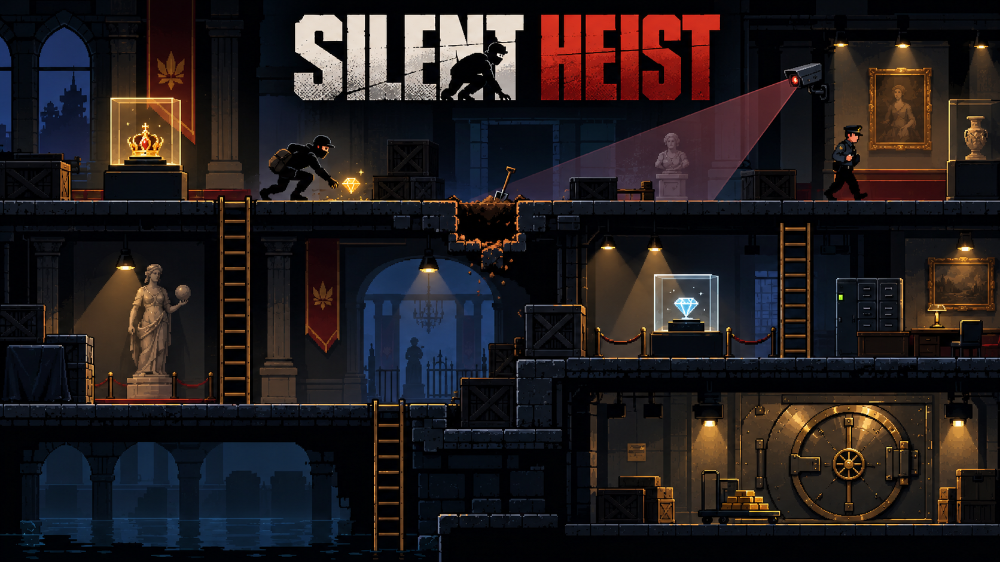
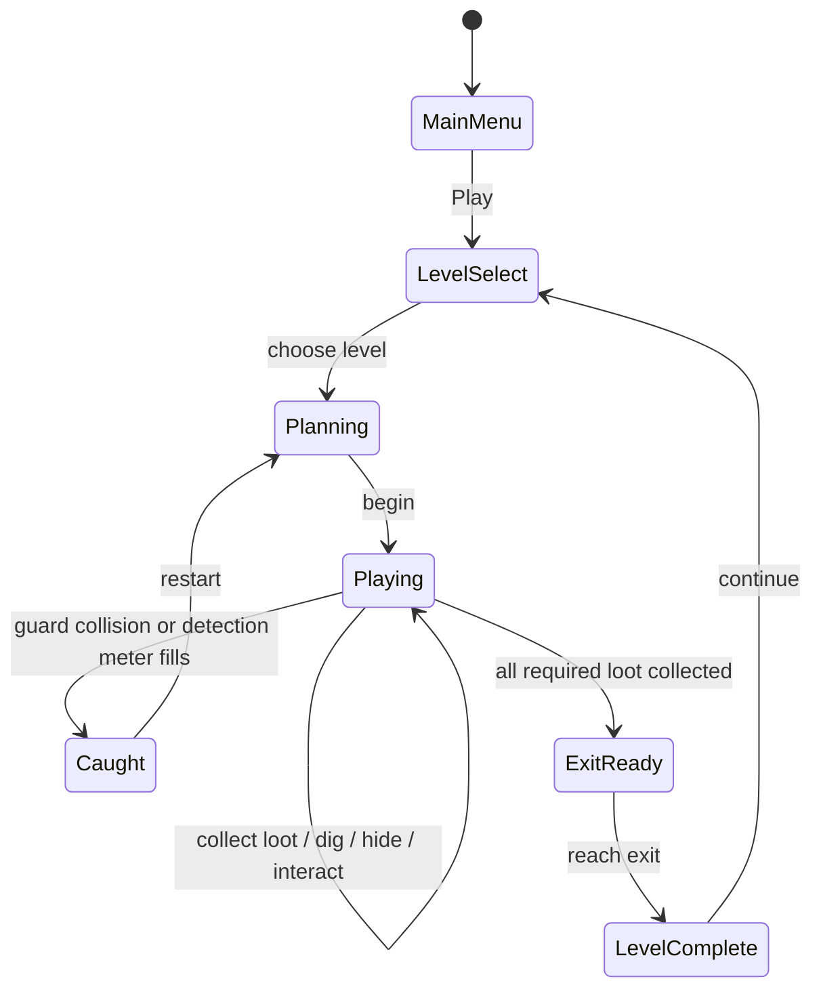
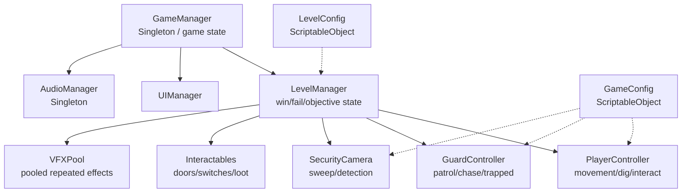
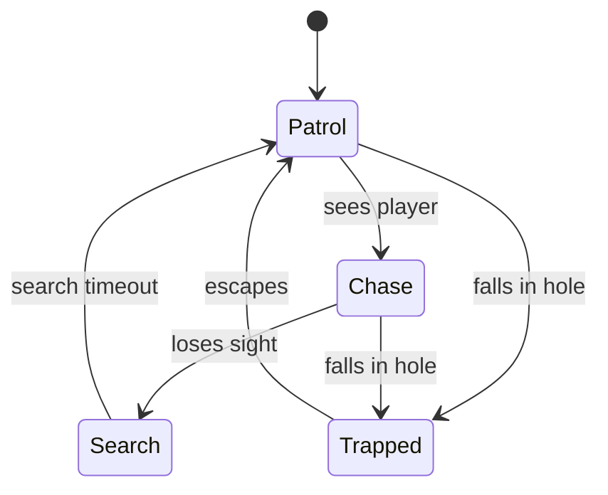

# Game Design Document — *Silent Heist*

*Figure 1. Silent Heist concept art showing the intended tone: a side-view museum/vault heist with ladders, loot, guards, cameras, and a temporary dug hole inspired by Lode Runner and Bob the Robber.*

| | |
|---|---|
| **Working title** | Silent Heist |
| **Team** | Abed Alqader — Solo Developer / Game Designer |
| **Genre** | 2D stealth-puzzle platformer |
| **Target platform** | Windows PC + Android mobile |
| **Engine / Unity version** | Unity 6.3 LTS — 6000.3.20f1, 2D |
| **Orientation & reference resolution** | Landscape, 1920 × 1080 reference |
| **Expected session length** | 3–8 minutes per level |
| **Document version** | v0.1 — 2026-10-04 |

---

## 1. High Concept

**Silent Heist** is a 2D stealth-puzzle platformer inspired by *Lode Runner* and *Bob the Robber*. The player infiltrates guarded buildings, collects required valuables, avoids or distracts guards and cameras, and uses temporary floor traps to create escape routes. Each handcrafted level ends when all required loot is collected and the player reaches the exit without being caught.

### Design pillars

1. **Plan before moving** — every room should present a readable stealth puzzle. Random hazards, unfair enemy spawns, and unavoidable hits are excluded.
2. **Classic movement, modern stealth** — keep the *Lode Runner* identity of running, climbing and digging temporary holes, while adding guards, cameras, switches and locked routes inspired by modern stealth games.
3. **Short, replayable levels** — levels should be completable in a few minutes, restart quickly, and reward cleaner runs. Long cutscenes, grinding and large open maps are intentionally excluded.

---

## 2. Reference & Inspiration

### Silent Heist concept art

The image below is an original concept-art style mockup for the project. It is **not** final gameplay art, but it communicates the intended tone, environment, and main mechanics: stealth movement, ladders, museum/vault treasure, guards, camera cones, and a temporary dug hole.

### Primary reference — Lode Runner

- **Official reference:** https://www.loderunnerclassic.com/
- **Video:** https://www.youtube.com/watch?v=CuXwDKW6G0g
- **Taking:** static maze-like levels, ladders, no jumping, collecting loot, enemy pursuit, digging temporary holes in the floor, and using holes to escape or trap enemies.
- **Not taking:** the exact original levels, score-chasing focus, 150-level structure, retro-only presentation, or direct recreation of the original enemy AI.

### Secondary reference — Bob the Robber

- **Gameplay reference:** https://www.youtube.com/watch?v=RzQIj0RdHos
- **Taking:** stealth theme, guards, cameras, interacting with switches/doors, entering a building to steal valuables, and the tension of avoiding detection.
- **Not taking:** direct level copies, exact art style, exact characters, combat, or puzzle solutions.

### What makes Silent Heist different

Silent Heist combines the **terrain-manipulation puzzle mechanic** of *Lode Runner* with a **stealth-security layer**. The player is not only running away from enemies; they are planning routes around guard patrols, camera vision, locked doors and temporary holes. The goal is a compact puzzle game where the same level can be solved safely or quickly.

---

## 3. Core Game Loop

### Moment-to-moment rules

- The player moves left/right and climbs ladders. **There is no jump button.**
- The player can dig one temporary hole diagonally down-left or down-right only if the target tile is diggable and the adjacent space is valid.
- A dug tile disappears immediately, stays open for approximately **4 seconds**, then rebuilds automatically.
- The player can fall through a dug hole. A guard can also fall into it and becomes trapped for a short time before escaping.
- Guards follow fixed patrol routes. If a guard gains line of sight to the player, it enters **Alert/Chase** state.
- Guard contact with the player causes an immediate fail.
- Security cameras sweep between fixed angles. Staying inside a camera cone fills a detection meter; leaving the cone drains it.
- If the detection meter reaches 100%, the player is caught.
- Switches can disable a camera, open a door, or change part of the level for a limited or permanent duration.
- Required loot is collected by touching or interacting with it. Once all required loot is collected, the exit becomes active.
- The level is completed only when the player reaches the exit after collecting all required loot.

### Scoring / result

The game is not primarily score-based. The Level Complete screen shows:

- completion time,
- required loot collected,
- optional loot collected,
- number of alerts,
- **Silent** badge if the level was completed with zero alerts,
- best completion time saved locally.

### Failure

Failure happens when:

- a guard touches the player,
- the camera detection meter reaches 100%,
- the player falls into an invalid death zone.

On failure, gameplay stops, a short caught animation/sound plays, and a **Restart** button appears. Restart should return to gameplay in about 1–2 seconds.

### Parameters to tune

| Parameter | What it controls | First guess |
|---|---|---:|
| `playerMoveSpeed` | Horizontal movement speed | 5.0 |
| `climbSpeed` | Ladder climbing speed | 4.0 |
| `digCooldown` | Delay between digs | 0.35 s |
| `holeLifetime` | Time before a dug tile rebuilds | 4.0 s |
| `guardPatrolSpeed` | Normal guard speed | 2.5 |
| `guardChaseSpeed` | Guard speed while chasing | 3.6 |
| `guardVisionDistance` | How far guards can see | 6 units |
| `cameraSweepSpeed` | Camera rotation speed | 40°/s |
| `cameraDetectionTime` | Continuous exposure needed to fail | 1.25 s |
| `detectionDrainRate` | How fast detection drains after hiding | 1.0/s |
| `trappedGuardTime` | Time a guard remains trapped | 2.5 s |
| `levelTransitionDelay` | Delay before loading next/result screen | 0.75 s |

**Where these live:** a `GameConfig` ScriptableObject for shared tuning values, with level-specific overrides stored in a `LevelConfig` ScriptableObject.

**Feel target:** a first-time player should understand Level 1 within two attempts, complete it within five attempts, and clearly understand why every failure happened.

---

## 4. Controls & Input

| Action | Keyboard / Mouse | Gamepad | Touch |
|---|---|---|---|
| Move left/right | A/D or ←/→ | Left stick | On-screen stick / arrows |
| Climb up/down | W/S or ↑/↓ | Left stick | On-screen stick / arrows |
| Dig left | Q | Left trigger / shoulder | Left dig button |
| Dig right | E | Right trigger / shoulder | Right dig button |
| Interact | F / Space | South button | Interact button |
| Pause | Esc | Start | Pause icon |

- Input is read in `Update`.
- Physics movement is applied in `FixedUpdate`.
- Gameplay input is disabled while pause, caught, or level-complete UI is active.
- Touch controls are placed in the lower corners and do not cover the main play area.
- UI uses **Canvas Scaler → Scale With Screen Size** so the layout adapts to different mobile resolutions.
- The same gameplay actions are mapped through Unity's Input System so PC and mobile do not need separate player logic.

---

## 5. Screens & UI

1. **Main Menu** — title, Play, Settings, Quit.
2. **Level Select** — three level buttons, best time, Silent badge, locked/unlocked state.
3. **Gameplay HUD** — required loot counter, optional loot counter, detection meter, pause button.
4. **Pause Menu** — Resume, Restart, Main Menu.
5. **Caught Screen** — “CAUGHT”, Restart, Main Menu.
6. **Level Complete** — completion time, best time, optional loot, alerts, Silent badge, Next Level / Level Select.
7. **Settings** — master volume, music volume, SFX volume.

### HUD during play

Visible:
- required loot count,
- detection meter only when detection is above zero,
- pause button,
- optional compact interaction prompt near the player.

Deliberately absent:
- health bar,
- weapon/ammo UI,
- minimap,
- large permanent tutorial text.

### Canvas setup

- Screen Space — Overlay
- Canvas Scaler: **Scale With Screen Size**
- Reference resolution: **1920 × 1080**
- Match: **0.5**
- Landscape orientation
- Safe-area support for Android devices

---

## 6. Art & Audio

### Visual direction

A readable 2D pixel-art style with strong silhouettes and clear gameplay colors:

- player: dark thief silhouette with a brighter accent,
- guards: clearly different color from player,
- camera vision: translucent cone,
- guard alert: visible icon / red state,
- diggable blocks: visually distinct from permanent walls,
- exit: locked appearance until all required loot is collected.

### Asset manifest

| Asset | Variants / frames | Source & licence | Use |
|---|---|---|---|
| Environment tiles / blocks | platform tiles, ladders, props | Kenney Pixel Platformer — CC0 | Walls, floors, ladders, background props |
| UI icons / buttons | buttons, indicators | Kenney UI / custom simple shapes — CC0 or original | Menus and HUD |
| UI sounds | clicks / confirmations | Kenney Interface Sounds — CC0 | Menu feedback |
| Player / guard sprites | idle, walk, climb, caught | Original edits or CC0-compatible sprites | Main characters |
| Dig / dust VFX | short particle burst | Unity particle system, original setup | Digging feedback |
| Alert VFX | icon + pulse | Original simple sprite / particle | Guard and camera feedback |
| Music | low-key stealth loop | CC0 / properly licensed source selected before release | Background ambience |
| Gameplay SFX | footsteps, loot, dig, alarm, door | CC0 / properly licensed source selected before release | Gameplay feedback |

**Licence note:** only CC0, original, or otherwise explicitly licensed assets will be committed to the public repository. Every third-party asset will be listed with its source and licence in the final README. Paid or restricted raw assets will not be committed to a public repository.

### Technical art rules

- Pixel-art sprites use Point filtering.
- Environment uses a Tilemap where practical.
- Sorting layers: `Background → World → Interactables → Characters → VFX → UI`.
- Camera/guard vision cones remain semi-transparent and visually readable.
- Repeated VFX are pooled rather than created/destroyed during gameplay.

---

## 7. Technical Design

### Scenes

- `Boot.unity` — initializes persistent managers and configuration.
- `MainMenu.unity` — main menu and level select.
- `Level01.unity` — Training Vault.
- `Level02.unity` — Security Wing.
- `Level03.unity` — Master Vault.

### Packages / systems used

- Unity Input System
- Physics2D
- Tilemap
- TextMeshPro
- Unity Object Pool
- ScriptableObjects
- PlayerPrefs
- Optional Cinemachine 3 for subtle camera polish

### Target device

- Primary development/demo: Windows PC.
- Required mobile build: Android in landscape orientation.

### Architecture

### Script responsibilities

| Script | Responsibility |
|---|---|
| `GameManager` | Global state, scene flow, level unlocks |
| `LevelManager` | Current level objectives, fail/complete state |
| `PlayerController` | Player movement, ladder movement, dig requests |
| `PlayerInteractor` | Switch, loot, door and exit interaction |
| `DigSystem` | Validates dig targets and controls temporary holes |
| `TemporaryHole` | Hole lifetime, rebuild timing, trapped guard handling |
| `GuardController` | Guard movement and state transitions |
| `GuardVision` | Line-of-sight detection |
| `SecurityCamera` | Sweep and camera detection contribution |
| `DoorController` | Locked/open state |
| `SwitchController` | Activates a linked target |
| `LootItem` | Required/optional loot collection |
| `ExitDoor` | Opens only after required loot is complete |
| `UIManager` | HUD and menu updates |
| `AudioManager` | Music and SFX playback |
| `VFXPool` | Reuses dig dust, alert pulse and other repeated VFX |
| `GameConfig` | Shared tuning data |
| `LevelConfig` | Per-level objective and tuning data |
| `SaveSystem` | PlayerPrefs for unlocked levels, best times and settings |

### Guard state machine

### Course features implemented

1. **Singleton** — `GameManager` and `AudioManager` provide one shared source of truth across scenes, matching their global responsibilities.
2. **Coroutines** — temporary floor rebuilding, guard trapped duration, short alert/search timers and level transition delays use coroutines because they are time-based multi-frame actions.
3. **Object Pooling** — dig dust, alert pulses and repeated noise/VFX objects are reused instead of repeatedly instantiating/destroying them during play.
4. **ScriptableObjects** — shared tuning values and level data live outside MonoBehaviours so values can be changed from the Inspector without recompiling.
5. **Events / Observer style** — loot collection, detection change, caught state and level completion fire events. UI listens to them instead of polling every frame.
6. **PlayerPrefs** — saves unlocked levels, best times, Silent badges and audio settings.
7. **Mobile build** — Android build with touch controls, safe-area-aware UI and landscape orientation.
8. **Physics2D / Colliders / Triggers** — movement, ladders, loot, exits, guards and detection zones.
9. **Audio + Animation** — one-shot sound effects, background loop, and character/UI feedback animations.
10. **Optional polish** — Cinemachine camera impulse/shake for caught/level-complete moments, kept subtle so it does not hurt puzzle readability.

---

## 8. Scope

### 8.1 MVP — the game is not a game without these

- [ ] Main menu and level select
- [ ] Three handcrafted levels
- [ ] Player left/right movement
- [ ] Ladder climbing
- [ ] Dig left / dig right
- [ ] Temporary floor rebuilding
- [ ] Guards with patrol and chase
- [ ] Guards can be trapped in holes
- [ ] Required loot collection
- [ ] Exit opens after required loot is collected
- [ ] Security cameras with detection meter
- [ ] Doors and switches
- [ ] Fail / restart flow
- [ ] Level complete flow
- [ ] Basic sound and animation
- [ ] Singleton manager
- [ ] Coroutines
- [ ] Object pooling
- [ ] ScriptableObject configuration
- [ ] Android mobile controls and build

### Level plan

**Level 1 — Training Vault**
- teaches movement, ladders, loot and digging,
- 1 guard,
- no security camera,
- one simple door/switch,
- short and forgiving.

**Level 2 — Security Wing**
- 2 guards,
- first security cameras,
- route choice between safe/slow and risky/fast paths,
- optional loot,
- one camera-disable switch.

**Level 3 — Master Vault**
- combines guards, cameras, ladders, temporary holes and locked routes,
- multiple required loot locations,
- more interconnected layout,
- final escape section,
- designed to demonstrate the full game rather than introduce new systems.

### 8.2 Polish — only after the MVP is fully playable

- [ ] Guard alert icon and camera detection animation
- [ ] Dig dust and debris VFX
- [ ] Screen/camera shake on caught
- [ ] Silent completion badge
- [ ] Optional loot
- [ ] Best times
- [ ] Better transitions and fade effects
- [ ] Improved background art / parallax
- [ ] Footstep and environmental audio
- [ ] Short tutorial prompts in Level 1
- [ ] Pause/settings screen polish

### 8.3 Explicitly out of scope — we are **not** building these

- Multiplayer or online leaderboards
- Procedurally generated levels
- Combat, weapons or health system
- Boss fights
- Large open-world maps
- Inventory management
- Skill tree / upgrades / shop
- Character customization
- More than three full levels before the core game is complete
- Cloud saves or accounts
- Dialogue system / long story cutscenes
- Complex pathfinding beyond what the handcrafted levels need

---

## Changelog

| Version | Date | Change |
|---|---|---|
| v0.1 | 2026-10-04 | Initial Silent Heist GDD based on Lode Runner + Bob the Robber inspiration |
